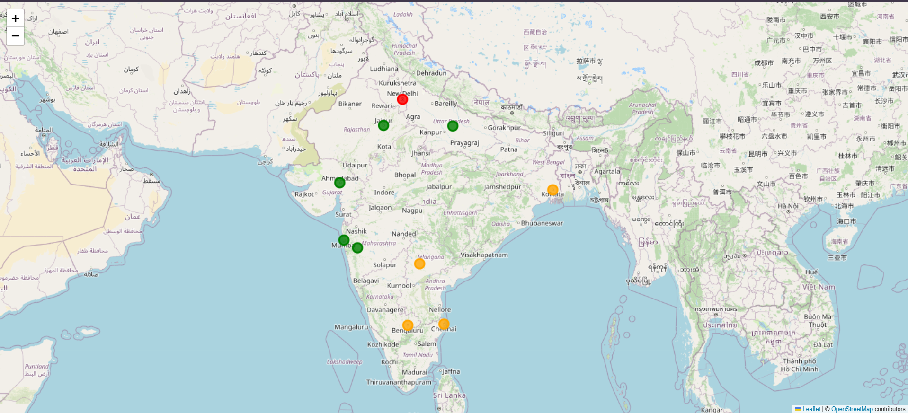

# 🚨 AI Crime Hotspot Prediction System (India)

An end-to-end **AI & Machine Learning project** that predicts **crime hotspots across Indian cities**, analyzes **crime trends**, and visualizes results using an **interactive geospatial map**.

This project demonstrates real-world usage of **data science, clustering algorithms, geospatial analysis, and predictive modeling**.

---

## 🗺️ Crime Hotspot Visualization

> Red/Orange/Green markers indicate **AI-predicted crime hotspot levels** across Indian cities.

---

## ✨ Key Features

- 📊 City-wise crime aggregation
- 🤖 AI-based hotspot prediction (Low / Medium / High)
- 📈 Crime trend analysis (Increasing / Decreasing)
- 🗺️ Interactive crime hotspot map (Folium)
- 🔮 Real-time prediction using trained ML model
- 💾 Model persistence using Joblib

---

## 🧠 Tech Stack

- **Python**
- **Pandas & NumPy** – Data processing
- **Scikit-learn** – KMeans clustering, scaling
- **Folium** – Interactive maps
- **Joblib** – Model saving & loading
- **Jupyter Notebook** – Analysis & experimentation

---

## 📂 Dataset

- **Indian Crime Dataset (2023)**
- City-level crime records from multiple Indian cities
- Includes crime type, case status, dates, and city information
  Dataset Link - https://www.kaggle.com/datasets/sudhanvahg/indian-crimes-dataset

---

## ⚙️ Project Architecture

ai-crime-hotspot-prediction/
│
├── data/ # Raw dataset
├── models/ # Trained ML models & mappings
├── notebooks/ # Data analysis & visualization
├── src/ # Prediction logic
├── outputs/ # Generated maps
├── assets/ # Screenshots & visuals
└── README.md

## 🚀 How to Run the Project

### 1️⃣ Clone Repository

git clone https://github.com/OfficialTanishGupta/ai-crime-hotspot-prediction.git
cd ai-crime-hotspot-prediction

2️⃣ Install Dependencies

pip install -r requirements.txt

3️⃣ Run Notebooks

Open Jupyter Notebook and execute:
train_model.ipynb
hotspot_map.ipynb

🔮 Predict Crime Hotspot (Example)
from src.predict import predict_hotspot

predict_hotspot(
crime_count=5400,
latitude=28.6139,
longitude=77.2090
)

Output

'high'

📈 Sample Results
City Crime Count AI Hotspot Level
Delhi 5400 High
Mumbai 4415 Medium
Jaipur 1479 Low

📌 Future Enhancements

⏳ Time-series crime forecasting
🌐 Flask / FastAPI backend
📱 Android app integration
🧠 Deep learning-based hotspot detection
👮 Police resource allocation insights

👨‍💻 Author

Tanish Gupta
B.Tech (AI/ML)
AI • Machine Learning • Data Science

🔗 GitHub: https://github.com/OfficialTanishGupta

⭐ If you find this project useful, please star the repository

# ✅ STEP 3 — PUSH CHANGES TO GITHUB

Run these commands:
git add README.md assets/map_preview.png
git commit -m "docs: add professional README with map visualization"
git push
